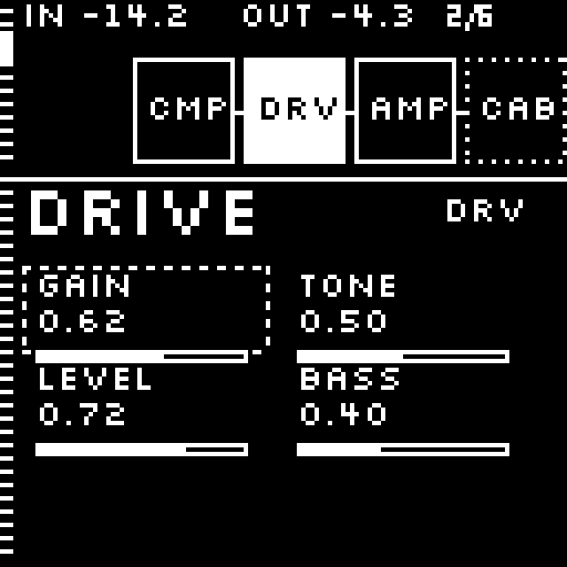
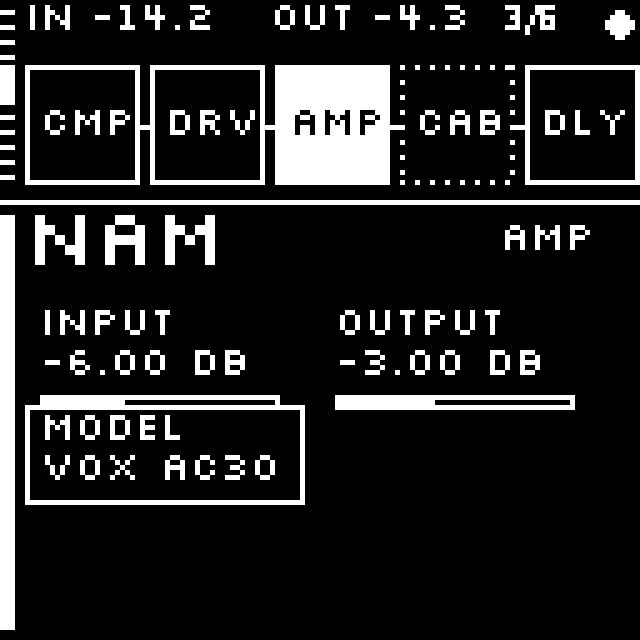
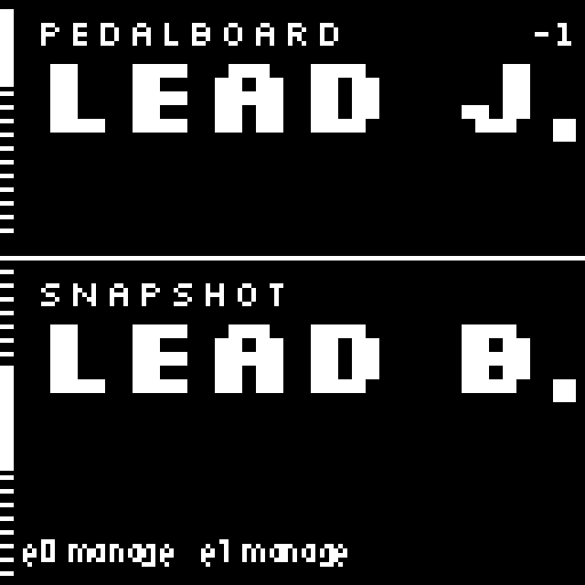
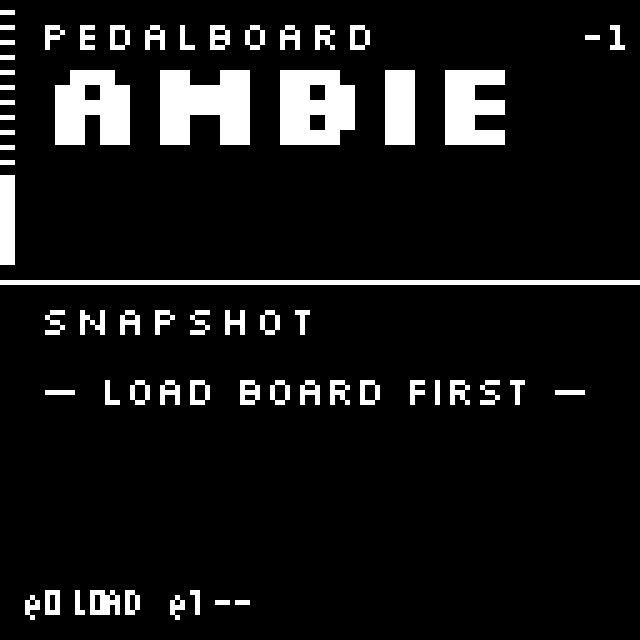

# Ganglion — GECO1

**Headless control app for GECO1**, a small pisound desk rig: a 128×128 I²C OLED
(SH1107) and **two rotary encoders** (push + RGB, seesaw), in place of a
touchscreen. Sibling to [Synapse](../README.md) (GCaMP6s' touchscreen app); it
reuses Synapse's pure logic layers (`model` · `modepctrl` · `plugincatalog` ·
`monitorfeed`) by import, with **0 edits to the synapse core**. Everything below
lives self-contained under `ganglion/`.

> Two knobs, one 1-bit screen. **ENC0** drives the top region, **ENC1** the
> bottom; the 3px left rail "points back" at whichever hand is live. See
> [`docs/design.md`](docs/design.md) for the full model.

## Screens

**Chain** (depth 0) — the pedal chain up top (ENC0 scrolls nodes), the focused
node's knobs below (ENC1 browses; click locks one and turns it):

| Browsing knobs | Knob locked / adjusting |
|---|---|
|  |  |

**Glance** (depth −1, ENC0-hold up from the chain) — pedalboard + snapshot at a
glance; ENC0 scrolls boards, ENC1 scrolls snapshots, click loads / manages:

| Loaded board + snapshot | Scrolled off the loaded board |
|---|---|
|  |  |

> These are `render(st)` output from the real 1-bit PIL pipeline
> (`assets/screens/*.png`) — exactly what the SH1107 receives. Drive the same UI
> live in a terminal with the commands below.

## Run

```sh
python3 ganglion/app.py           # live controller in the terminal (keyboard = encoders, fake backend)
python3 ganglion/app.py --walk    # scripted walkthrough of every screen (no TTY, prints state)
python3 ganglion/app.py --live    # attach to a real MODEP host (mod-host / pisound) via GecoAdapter
python3 ganglion/app.py --device  # run on the real hardware (OLED + seesaw encoders)
```

Keyboard = encoders: `r`/`t` = ENC0 turn, `f`/`g` = ENC1 turn, `w`/`s` = click,
`e`/`d` = hold, `x` = combo, `Q` = quit.

## File map

| File | Role |
|---|---|
| `app.py` | The 2a state machine — modes, controller, `render(st)`, the whole UI spine |
| `render.py` | 1-bit drawing primitives + pixel-font tiers for the 128×128 OLED |
| `input.py` | Input events + gesture recognition (rotate / press / combo), shared by every source |
| `runtime.py` | Headless main loop — ties input, view, splash, LEDs together |
| `display.py` | Mono framebuffer + the terminal renderer |
| `geco_backend.py` | The GECO **seam** — decouples the app from the board / catalog / persistence source (`FakeGeco` default) |
| `geco_adapter.py` | Live backend over the real synapse stack — the swap-in for `FakeGeco` |
| `geco_conform.py` · `geco_routing.py` | Pre-flight conform + Qt-free serial wiring for the live quick-mode board |
| `geco_whitelist.json` · `geco_catalog.json` | Curated plugin buckets for the picker |
| `design_screens.py` | The frozen design-2a screens (mockup reference) |
| `emulator.py` | Early standalone framebuffer emulator (placeholder screen — predates `app.py`) |
| `i2c_cost.py` | SH1107 redraw byte-cost model |
| `hw/seesaw.py` | Real encoder driver (Adafruit seesaw) |
| `tools/catalog.py` | Standalone plugin-catalog curation CLI |

## Docs

| Doc | What's in it |
|---|---|
| [`docs/design.md`](docs/design.md) | The design — hardware spec, the 2a interaction model, screen-by-screen decisions |
| [`docs/decisions.md`](docs/decisions.md) | Running implementation-decision log as the mockup was ported to `app.py` |
| [`docs/plugin-whitelist.md`](docs/plugin-whitelist.md) | How the picker's plugin buckets are curated |
| [`docs/encoder-rail-todo.md`](docs/encoder-rail-todo.md) · [`docs/workflow-review-todo.md`](docs/workflow-review-todo.md) | Open threads |
